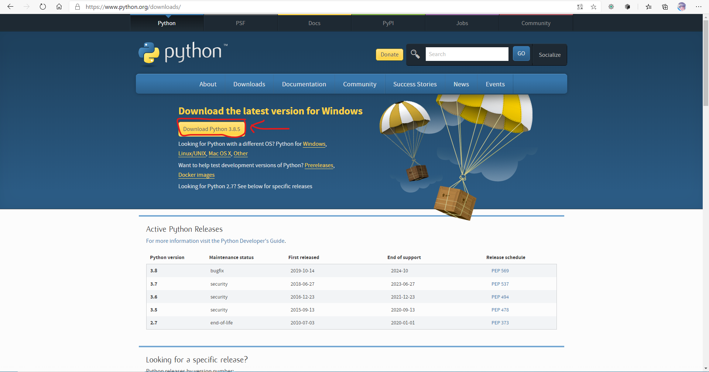

# 파이썬을 설치하는 방법
#### 1. https://www.python.org 에 접속해 Download 탭을 클릭합니다.
  
***
#### 2. 붉은색으로 표시해둔, 최신버전 다운로드 버튼을 눌러 최신버전의 파이썬 설치기를 다운받습니다.
  
***
#### 3. 다운받은 설치기를 실행해, Add to Path 옵션을 선택한 후 Install Now를 눌러 설치를 진행합니다.
  
***
#### 4. 설치가 완료되면 close 버튼을 눌러 종료합니다. 윈도우 버튼을 눌러 프로그램 목록에서 Python (버전) 폴더에 파이썬이 추가되어있는지 확인합니다.
  
***
