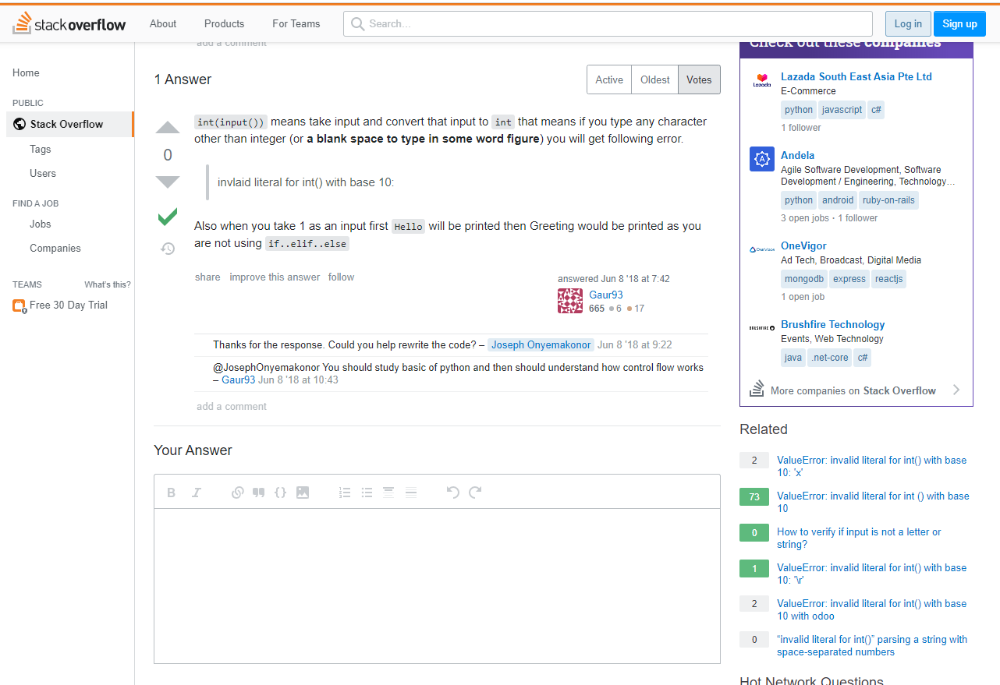

# StackOverflow : 개발자들의 지식in
이전 1강에서, 구글링을 하는 방법에 대해 알아보았습니다.
여러 프로그래밍 정보들을 구글에서 찾아보다 보면, 항상 자주 보이는 사이트가 한 개 있습니다.
바로, 그 이름도 유명한 [StackOverflow](https://stackoverflow.com/) 입니다.

## Stack Overflow는 어떤 사이트인가요?
언젠가 궁금증이 생겨, 혹은 도움이 필요해 네이버의 지식in에 질문해본 경험이 있으실거에요.
Stack Overflow는 전세계의 개발자들이 지식in처럼 질문을 하고, 정보를 공유하는 사이트에요.
다양한 실력의 개발자들이 서로 질문하고, 답변하면서 정보를 공유하고, 원하는 질문에 대한 답을 얻어갈 수 있어요.

## Stack Overflow를 어떻게 이용하면 되나요?
이전 1강에서 발생한 오류를 Stack Overflow에서 검색해봅시다! [검색하기](https://stackoverflow.com/questions/50755460/simple-code-gets-valueerror-invalid-literal-for-int-with-base-10)


스택 오버플로우 페이지로 들어가 보니, 이런 화면이 나타나네요.
당장 상단에 보이는건 질문의 내용이에요.
많은 사람들이 영어를 사용하기 때문에, 자신의 모국어가 무엇이건 Stack Overflow에서는 영어로 대화가 오가요.
질문의 내용을 보니, 우리가 찾고자 하는 오류가 질문에 제시되어있네요.
그렇다면 우리가 찾는 해답이 이 질문에 대한 답변중에 있지 않을까요?


발견했네요!
답변 부분에 적혀있는 내용을 읽어보니, 정수가 아닌 값이 들어있는 문자열을 int()를 통해 타입 변환을 시도했을 때 이러한 오류가 발생한다고 하네요.
찾은 답변을 통해, 우리는 1강의 코드를 이렇게 고쳐서 문제를 해결할 수 있습니다!

[코드]
```python
a = '2'
print(int(a))
```
[출력]
```commandline
2
```

[<- 이전 강좌](Tips/01-Google_It/README.md)